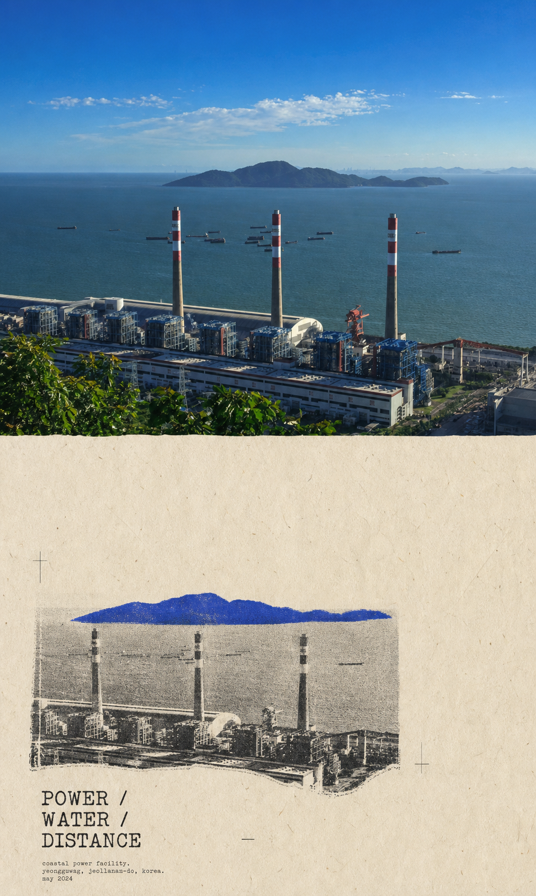
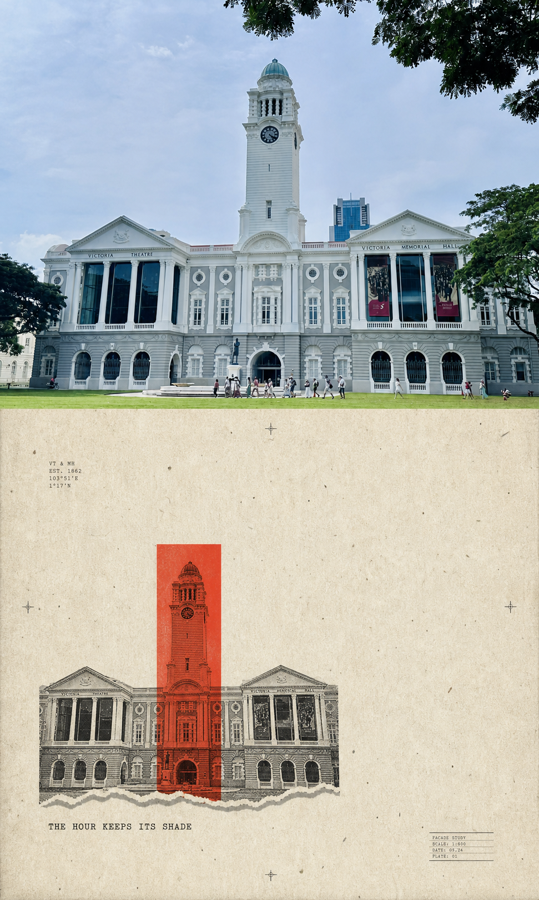
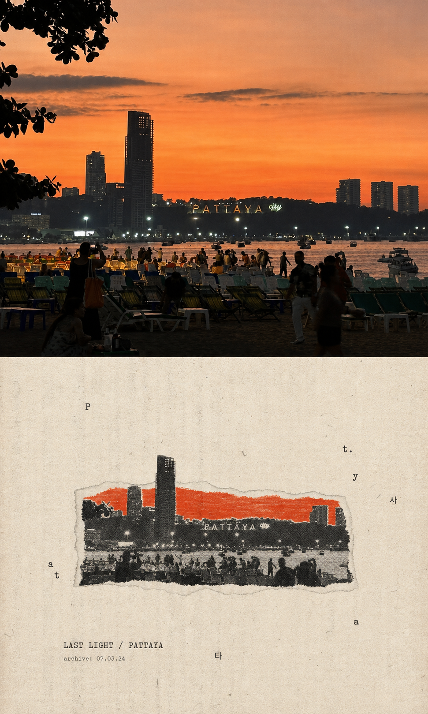
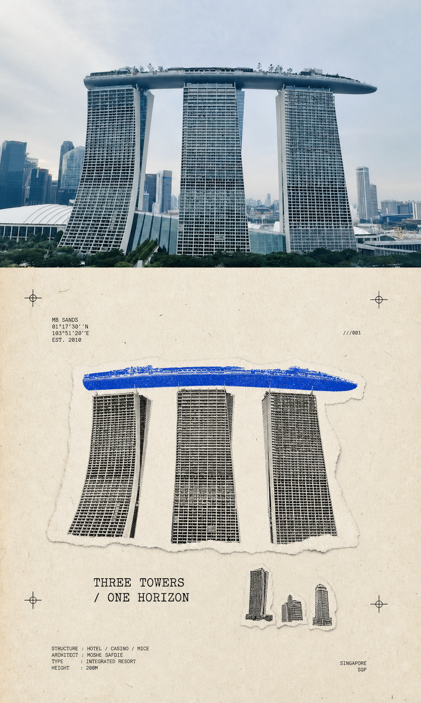

# 魔幻画 · Minimal Zine Poster

把一张照片、一句话、一个物件或一段内容灵感，变成带有纸本质感的极简 zine 海报。

`gc-minimal-zine-poster-v0-1` 是一个面向 Codex 的图像生成 skill：它会先把自然语言编译为结构化 Prompt，再调用图像生成能力，返回海报成图、最终 Prompt 与本次的视觉配方。

## 它适合做什么

- 把旅拍、街拍或产品照片改造成有编辑感的内容封面
- 为文章、播客、活动或社交媒体制作统一的视觉配图
- 将抽象主题、短句、情绪或一个物件转成可视化海报
- 批量生成同一视觉语言、但版式与主体不同的系列作品

## 视觉语言

| 规则 | 效果 |
| --- | --- |
| 3:5 竖版纸张 | 适合手机阅读、社媒封面与海报展示 |
| 大面积留白 | 让画面安静，主体更集中 |
| 单一视觉锚点 | 用一个物件、剪影、照片碎片或色块讲清核心意思 |
| 一种高饱和主色 | 在缩略图尺寸仍保持辨识度 |
| 旧纸、网点、复印与孔版印刷 | 形成低保真、纸本、独立杂志的质感 |
| 档案微文本与小号字 | 让文字成为构图的一部分，而不是广告标题 |

它会主动规避满版商业海报、Logo/CTA、3D、霓虹、电影级光影、密集拼贴和过长正文等常见的 AI 视觉套路。

## 示例

下面的案例采用“上方保留原图、下方展示 zine 化重构”的对照版式；这是在 skill 基础规则上加入的定制指令。

| 深圳小南山工业海岸 | 新加坡维多利亚剧院 |
| --- | --- |
|  |  |

| 芭提雅日落 | 新加坡滨海湾金沙 |
| --- | --- |
|  |  |

## 在 Codex 中使用

### 1. 安装 skill

将仓库中的 skill 文件夹复制到 Codex 的个人 skills 目录：

```bash
git clone https://github.com/jarvis-xy/magic-picture.git
mkdir -p ~/.codex/skills
cp -R magic-picture/skills/gc-minimal-zine-poster-v0-1 ~/.codex/skills/
```

安装后，重新打开 Codex 或新建一个任务，让它扫描新的 skill。

安装成功后的目录应为：

```text
~/.codex/skills/gc-minimal-zine-poster-v0-1/SKILL.md
```

### 2. 用主题生成海报

在 Codex 对话中输入：

```text
使用 $gc-minimal-zine-poster-v0-1 做一张关于雨天旧书店的竖版海报。
```

### 3. 用照片生成海报

先在对话中附上一张照片，然后输入：

```text
使用 $gc-minimal-zine-poster-v0-1 将这张照片做成安静的 zine 风格海报。
保留海边与建筑作为主体，使用钴蓝色作为唯一的高饱和色。
```

### 4. 生成前后对照海报

```text
使用 $gc-minimal-zine-poster-v0-1 将这张照片做成 3:5 竖版对照海报。
上方保留原图，下方把同一画面重构成旧纸、撕边、网点和复印质感。
下方只保留一个高饱和色锚点，并加入简短的档案式标题。
```

### 5. 只要 Prompt，不生成图片

```text
使用 $gc-minimal-zine-poster-v0-1 为“午夜渡口”写最终生图 Prompt。
只输出 Prompt，不要生成图片。
```

## 它如何工作

每次生成都会经过同一套编译流程：

1. 从输入中提取一个核心、可视觉化的主题，而不是把整段内容全塞进画面。
2. 选择一组变化配方：版式、主体类型、文字形式、印刷质感、情绪与主色。
3. 用四段式 Prompt 规定画布、视觉锚点、文字与颜色、纸本氛围与反向约束。
4. 生成图像，并在缩略图尺度检查高饱和色和留白是否足够清晰。

默认输出包含：

- 生成的海报图
- 实际使用的最终 Prompt
- Mode、Recipe 与简短的内容解读

## 常用输入模板

```text
使用 $gc-minimal-zine-poster-v0-1
主题：________
画面主体：________
情绪：________
希望出现的短句：________
主色：________
```

如果不指定主体、短句或主色，skill 会根据主题自行选择。

## 调整技巧

- 想更像杂志页：明确要求“80% 留白、一个小型主体、档案微文本”。
- 想突出照片：要求“保留照片的构图，只把下方或局部做成 xerox/halftone 重构”。
- 想做系列：保持同一纸色和主色，只替换主题、主体或布局。
- 想让颜色更醒目：要求“opaque / fully saturated”，并说明色块占视觉主体的比例。
- 想减少 AI 感：要求“flat scanned paper、no 3D、no cinematic light、no commercial layout”。

## 仓库结构

```text
magic-picture/
├── README.md
├── examples/
│   ├── shenzhen-industrial-coast.png
│   ├── singapore-victoria-theatre.png
│   ├── pattaya-last-light.png
│   └── singapore-marina-bay-sands.png
└── skills/
    └── gc-minimal-zine-poster-v0-1/
        └── SKILL.md
```

## Skill 文件

完整的视觉约束、Prompt 编译器、颜色规则、变化引擎、反向约束与质量检查见：[SKILL.md](skills/gc-minimal-zine-poster-v0-1/SKILL.md)。
